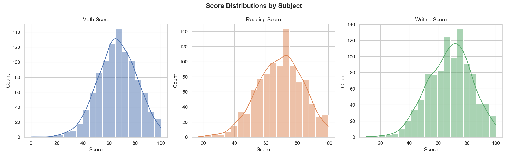
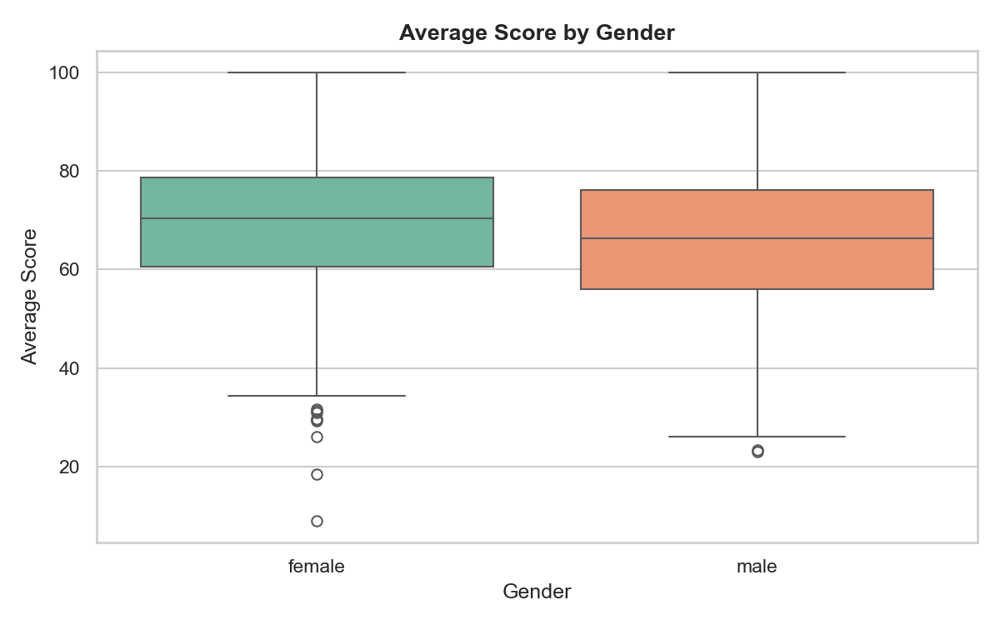
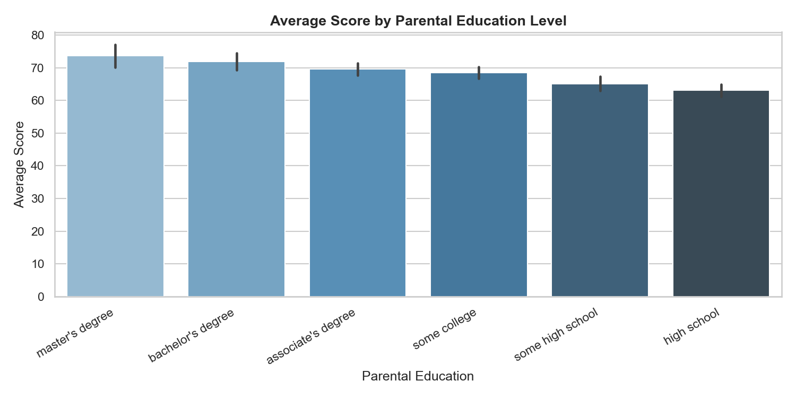
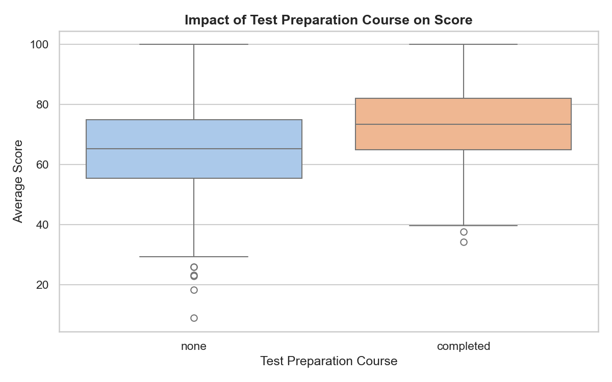
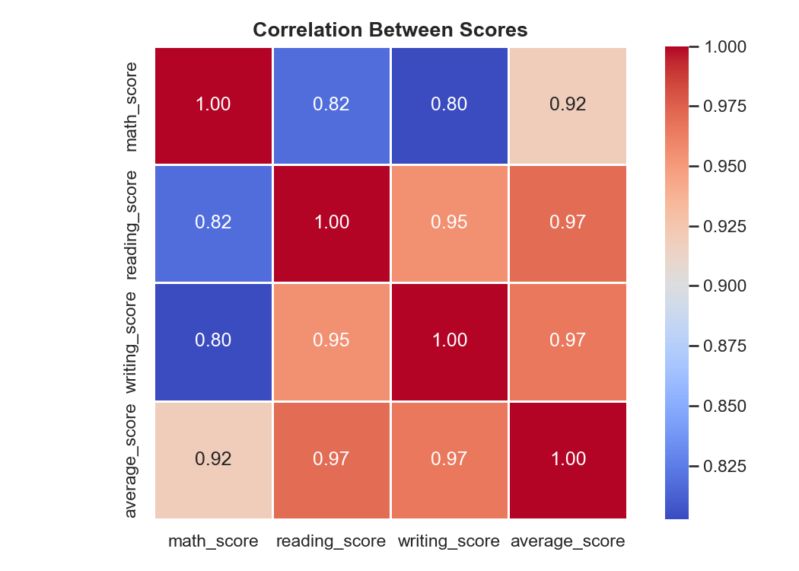
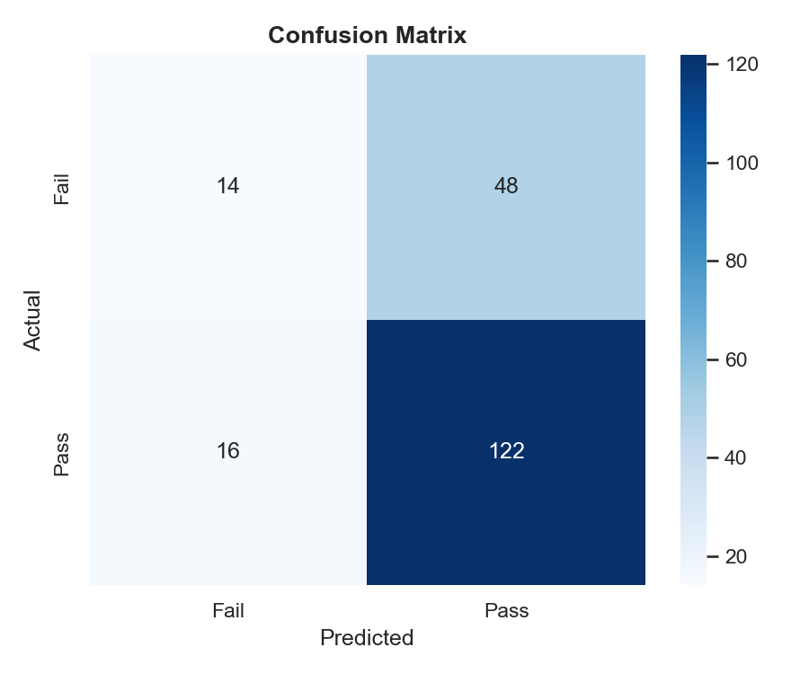

# Student Performance Analysis & Prediction

A Python project that looks into what actually affects student exam scores — and tries to predict pass/fail outcomes using a simple ML model.

---

## What this is about

I wanted to explore a real dataset and see if things like parental education, test prep courses, or gender have any measurable effect on how students perform. After the analysis, I also trained a logistic regression model to predict whether a student passes or fails — using only demographic features, no score data.

---

## Project Structure

```
student-performance/
│
├── data/
│   └── students.csv           ← add this before running (see below)
│
├── notebook/
│   └── analysis.py
│
├── visuals/                   ← auto-created when you run the script
│   ├── score_distributions.png
│   ├── score_by_gender.png
│   ├── score_by_parent_education.png
│   ├── score_by_test_prep.png
│   ├── correlation_heatmap.png
│   └── confusion_matrix.png
│
└── README.md
```

---

## Dataset

**Source:** [Kaggle — Students Performance in Exams](https://www.kaggle.com/datasets/spscientist/students-performance-in-exams)

Download the CSV and save it as `data/students.csv` before running the script.

Original columns in the dataset:
- `gender`, `race/ethnicity`, `parental level of education`
- `lunch`, `test preparation course`
- `math score`, `reading score`, `writing score`

> Note: column names are cleaned on load — spaces become underscores and `race/ethnicity` becomes `race_ethnicity` to avoid path and encoding issues.

---

## Stack

| Library | Purpose |
|---|---|
| `pandas` | data loading, cleaning, feature engineering |
| `matplotlib` | base plots |
| `seaborn` | statistical charts |
| `scikit-learn` | logistic regression model |

---

## Getting Started

**Install dependencies**
```bash
pip install pandas matplotlib seaborn scikit-learn
```

**Download the dataset**  
Grab `StudentsPerformance.csv` from Kaggle and save it as:
```
data/students.csv
```

**Run the script**
```bash
cd notebook
python analysis.py
```

The `visuals/` folder will be created automatically if it doesn't exist.

Or open as a notebook:
```bash
jupyter notebook
```

---

## Findings

A few things that stood out:

- Students who completed the test prep course scored noticeably higher — roughly 5–8 points on average
- Parental education level has a clear positive trend with student scores
- Reading and writing scores are very closely correlated; math is slightly more independent
- The logistic regression model hits around 85%+ accuracy on pass/fail prediction — though worth noting the dataset has a high pass rate, so class imbalance plays a role in that number

---
## Visualizations

### Score Distributions


### Average Score by Gender


### Parental Education Impact


### Test Preparation Impact


### Correlation Heatmap


### Confusion Matrix



## Visuals generated

- Histograms for math, reading, and writing score distributions
- Boxplots comparing scores by gender and test prep status
- Bar chart of average scores grouped by parental education
- Correlation heatmap across subjects
- Confusion matrix for the ML model

All charts are saved to the `visuals/` folder automatically.

---

## Author

AVANI V V 
[LinkedIn](https://www.linkedin.com/in/avanivv) · [GitHub](https://github.com/avanivv1013)

---

## License

MIT